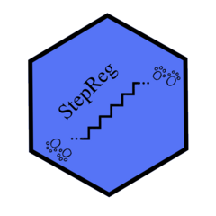

# StepReg <a href="https://github.com/JunhuiLi1017/StepReg"></a>
---
- #### An R package for stepwise regression analysis
---

## How to install
For released version:
```
install.packages("StepReg")
```

For development version:
```
library(devtools)
install_github("JunhuiLi1017/StepReg")
```

## Detailed usage
For released version, refer to CRAN [vignettes](https://CRAN.R-project.org/package=StepReg/vignettes/StepReg.html).

For development version, refer to this [vignettes](https://mccbbioinfo.github.io/tutorials/StepReg).

## Questions?
Please raise an issue [here](https://github.com/JunhuiLi1017/StepReg/issues/new).