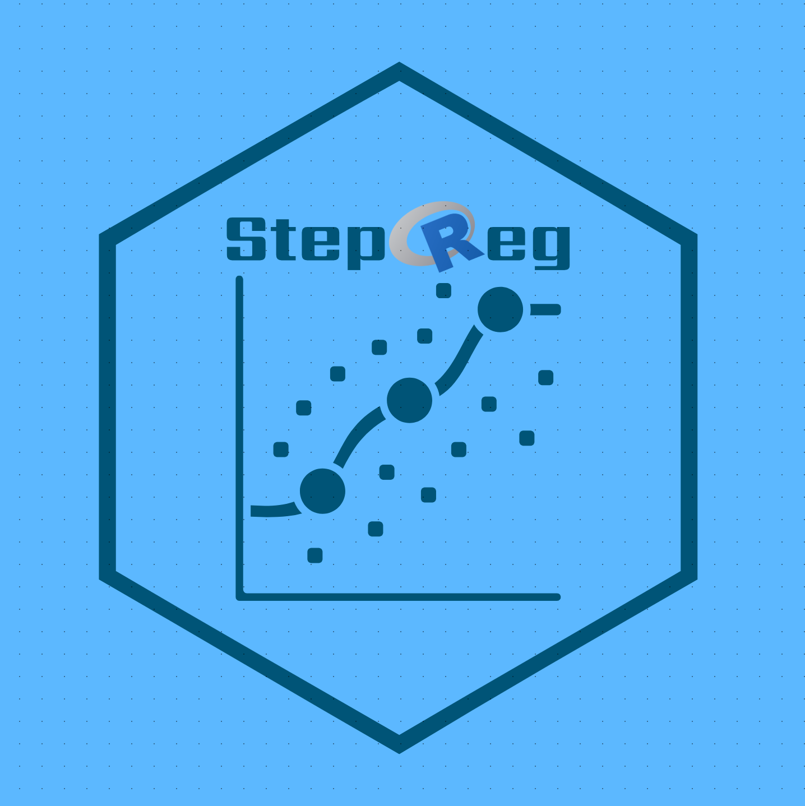

# StepReg

StepReg — Stepwise Regression Analysis  

Version: v1.4.4

 

## 1. Introduction

* What is the stepwise regression?
  
  Stepwise regression is a method of fitting regression models in which the choice of predictive variables is carried out by an automatic procedure.
  Three stepwise regression can be chosen, i.e. stepwise linear regression, stepwise logistic regression and stepwise cox regression.


## 2. Statistical and coding details in this package

* The main approaches:

* * Forward selection, which involves starting with no variables in the model, testing the addition of each variable using a chosen model fit criterion, adding the variable (if any) whose inclusion gives the most statistically significant improvement of the fit, and repeating this process until none improves the model to a statistically significant extent.

* * Backward elimination, which involves starting with all candidate variables, testing the deletion of each variable using a chosen model fit criterion, deleting the variable (if any) whose loss gives the most statistically insignificant deterioration of the model fit, and repeating this process until no further variables can be deleted without a statistically significant loss of fit.

* * Hybrid Approaches, a combination of the above, testing at each step for variables to be included or excluded.

* * Best subset selection, uses the branch-and-bound technique to efficiently search for subsets of model effects that best predict the response variable.

* Selection Criterion:
  
  AIC/AICc/BIC/Cp/HQ/HQc/Rsq/adjRsq/SBC/SL(Pvalue) based on F test and Approximate F test for linear regression, score test and wald test for logistic regression.

* Multicollinearity:
  
  qr matrix decomposition is performed before stepwise regression to detect and remvove variables causing Multicollinearity.

* Coding:
  
  We removed Cpp code from this version

## 3. Usage and Examples

```
#install.package("StepReg")

library(StepReg)

## stepwise linear regression

# remove intercept and add new variable yes which is the same as variable wt in mtcars dataset

data(mtcars)
mtcars$yes <- mtcars$wt
formula <- cbind(mpg,drat) ~ . + 0
stepwise(formula=formula,
         data=mtcars,
         include=NULL,
         selection="bidirection",
         select="AIC",
         sle=0.15,
         sls=0.15,
         multivarStat="Pillai",
         weights=NULL,
         best=NULL)

## stepwsise logistic regression

formula=vs ~ .
stepwiseLogit(formula,
              data=mtcars,
              include=NULL,
              selection="bidirection",
              select="SL",
              sle=0.15,
              sls=0.15,
              sigMethod="Rao",
              weights=NULL,
              best=NULL)
							
## stepwise cox regression
lung <- survival::lung
my.data <- na.omit(lung)
my.data$status1 <- ifelse(my.data$status==2,1,0)
data <- my.data
formula = Surv(time, status1) ~ . - status

stepwiseCox(formula,
data,
include=NULL,
selection=c("bidirection"),
select="SL",
method=c("efron"),
sle=0.15,
sls=0.15,
weights=NULL,
best=NULL)


```
## 4.Validation
* Reference

Result of multivariate stepwise regression are consistent with the reference
* SAS software validation

The final results from this package are validated with SAS software,

data set1 without class effect: 13 dependent variable, 129 independent variable and 216 samples.

data set2 with 4 class effect: 12 dependent variable, 1270 independent variable and 647 samples.

data set3 with 6 class effect: 5 dependent variable, 2068 independent variable and 412 samples.
