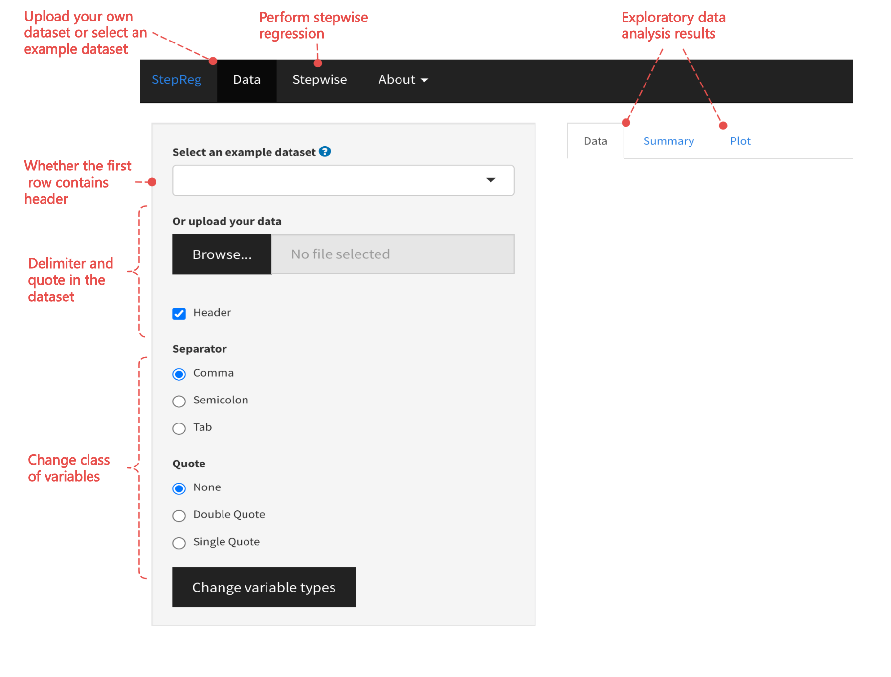
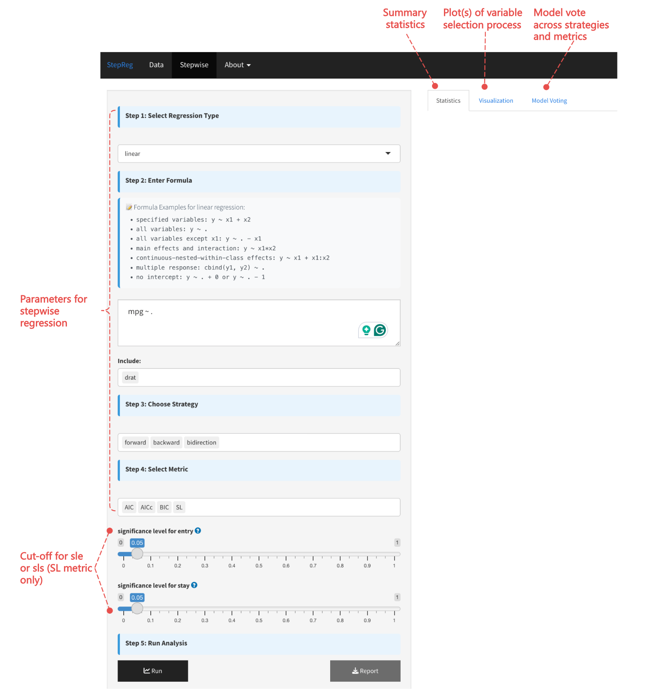

```{r include=FALSE}
knitr::opts_chunk$set(comment = NA)
```

# Introduction

Model selection is the process of identifying the most relevant features from a set of candidate variables. This step is critical for building models that are accurate, interpretable, and computationally efficient while avoiding overfitting. Stepwise regression algorithms automate this process by iteratively adding or removing features based on predefined criteria, such as statistical significance (e.g., p-values), information criteria (e.g., AIC or BIC), or other performance metrics. The procedure continues until no further improvements can be made according to the chosen criterion, resulting in a final model that includes the selected features and their corresponding coefficients.

However, it is important to note that stepwise regression should never be used for statistical inference unless the variable selection process is explicitly accounted for. Without proper adjustments, the selection process invalidates statistical inference, such as p-values and confidence intervals, due to issues like multiple testing and data dredging. This limitation does not apply when stepwise regression is used for prediction, as the primary goal in predictive modeling is to maximize accuracy rather than draw causal conclusions.

StepReg simplifies model selection tasks by providing a unified programming interface. It currently supports model buildings for five distinct response variable types (section \@ref(regressioncategories)), four model selection strategies (section \@ref(modelselectionstrategies)) including the best subsets algorithm, and a variety of selection metrics (section \@ref(selectionmetrics)). StepReg also supports advanced features including strata variables for Cox regression and continuous-nested-within-class effects for complex modeling scenarios (section \@ref(advancedfeatures)). Moreover, StepReg detects and addresses the multicollinearity issues if they exist (section \@ref(multicollinearity)). The output of StepReg includes multiple tables summarizing the final model and the variable selection procedures. Additionally, StepReg offers a plot function to visualize the selection steps and support a various formats of output (section \@ref(stepregoutput)). For demonstration, the vignettes include four use cases covering distinct regression scenarios (section \@ref(usecases)). Non-programmers can access the tool through an interactive Shiny application (section \@ref(shinyapp)).

By combining flexibility, robustness, and ease of use, StepReg is a powerful tool for predictive modeling tasks, particularly when the goal is to identify an optimal set of features for accurate predictions. However, users should exercise caution and avoid using StepReg for statistical inference unless the variable selection process is properly accounted for.

# Quick demo {#quickdemo}

The following example selects an optimal linear regression model with the `mtcars` dataset.
```{r, message = FALSE}
library(StepReg)
data(mtcars)
formula <- mpg ~ .
res <- stepwise(formula = formula,
                data = mtcars,
                type = "linear",
                include = c("qsec"),
                strategy = "bidirection",
                metric = c("AIC"))
```
Breakdown of the parameters:

+ `formula`: specifies the dependent and independent variables
+ `type`: specifies the regression category, depending on your data, choose from "linear", "logit", "cox", etc.
+ `include`: specifies the variables that must be in the final model
+ `strategy`: specifies the stepwise strategy, choose from "forward", "backward", "bidirection", "subset"
+ `metric`: specifies the model fit evaluation metric, choose one or more from "AIC", "AICc", "BIC", "SL", etc.

The output consists of final model, which can be viewed using:
```{r, message = FALSE}
res
```

You can further explore the results with S3 generic functions such as `summary()`, `coeff()`, and others. For example:
```{r, message = FALSE}
summary(res$bidirection$AIC)
```

You can also visualize the variable selection procedures with:
```{r, message = FALSE}
plot(res, strategy = "bidirection", process = "overview")
plot(res, strategy = "bidirection", process = "detail")
```

The `(+)1` refers to original model with intercept being added, `(+)` indicates variables being added to the model while `(-)` means variables being removed from the model.

Additionally, you can generate reports of various formats with:
```{r, eval = FALSE}
report(res, report_name = "path_to/demo_res", format = "html")
```
Replace `"path_to/demo_res"` with desired output file name, the suffix `".html"` will be added automatically. For detailed examples and more usage, refer to section \@ref(stepregoutput) and \@ref(usecases).

# Key features

## Regression categories {#regressioncategories}

**StepReg** supports multiple types of regressions, including *linear*, *logit*, *cox*, *poisson*, and *gamma* regressions. These methods primarily vary by the type of response variable, which are summarized in the table below. Additional regression techniques can be incorporated upon user requests.

```{r, echo = FALSE}
library(knitr)
library(kableExtra)

Regression <- c("linear", "logit", "cox", "poisson", "gamma")
Reponse <- c("continuous", "binary", "time-to-event", "count", "continuous and positively skewed")
df <- data.frame(Regression, Reponse)

kable(df, format = "html", caption = 'Common regression categories') %>% kable_styling()
```

## Model selection strategies {#modelselectionstrategies}

Model selection aims to identify the subset of independent variables that provide the best predictive performance for the response variable. Both stepwise regression and best subsets approaches are implemented in StepReg. For stepwise regression, there are mainly three methods: *Forward Selection*, *Backward Elimination*, *Bidirectional Elimination*.

```{r, echo = FALSE}
Strategy <- c("Forward Selection", "Backward Elimination", "Bidirectional Elimination", "Best Subsets")
Description <- c("In forward selection, the algorithm starts with an empty model (no predictors) and adds in variables one by one. Each step tests the addition of every possible predictor by calculating a pre-selected metric. Add the variable (if any) whose inclusion leads to the most statistically significant fit improvement. Repeat this process until more predictors no longer lead to a statistically better fit.",
                "In backward elimination, the algorithm starts with a full model (all predictors) and deletes variables one by one. Each step test the deletion of every possible predictor by calculating a pre-selected metric. Delete the variable (if any) whose loss leads to the most statistically significant fit improvement. Repeat this process until less predictors no longer lead to a statistically better fit.",
                "Bidirectional elimination is essentially a forward selection procedure combined with backward elimination at each iteration. Each iteration starts with a forward selection step that adds in predictors, followed by a round of backward elimination that removes predictors. Repeat this process until no more predictors are added or excluded.",
                "Stepwise algorithms add or delete one predictor at a time and output a single model without evaluating all candidates. Therefore, it is a relatively simple procedure that only produces one model. In contrast, the *Best Subsets* algorithm calculates all possible models and output the best-fitting models with one predictor, two predictors, etc., for users to choose from.")
df <- data.frame(Strategy, Description)

kable(df, format = "html", caption = 'Model selection strategy') %>% kable_styling()
```

Given the computational constraints, when dealing with datasets featuring a substantial number of predictor variables greater than the sample size, the Bidirectional Elimination typically emerges as the most advisable approach. Forward Selection and Backward Elimination can be considered in sequence. On the contrary, the Best Subsets approach requires the most substantial processing time, yet it calculates a comprehensive set of models with varying numbers of variables. In practice, users can experiment with various methods and select a final model based on the specific dataset and research objectives at hand.

## Selection metrics {#selectionmetrics}

Various *selection metrics* can be used to guide the process of adding or removing predictors from the model. These metrics help to determine the importance or significance of predictors in improving the model fit. In StepReg, selection metrics include two categories: *Information Criteria* and *Significance Level* of the coefficient associated with each predictor. *Information Criteria* is a means of evaluating a model's performance, which balances model fit with complexity by penalizing models with a higher number of parameters. Lower *Information Criteria* values indicate a better trade-off between model fit and complexity. Note that when evaluating different models, it is important to compare them within the same *Information Criteria* framework rather than across multiple Information Criteria. For example, if you decide to use AIC, you should compare all models using AIC. This ensures consistency and fairness in model comparison, as each Information Criterion has its own scale and penalization factors. In practice, multiple metrics have been proposed, the ones supported by StepReg are summarized below.

Importantly, given the discrepancies in terms of the precise definitions of each metric, StepReg mirrors the formulas adopted by [SAS](https://documentation.sas.com/doc/en/statcdc/14.2/statug/statug_glmselect_details15.htm) for *univariate multiple regression (UMR)* except for HQ, IC(1), and IC(3/2). A subset of the UMR can be easily extended to *multivariate multiple regression (MMR)*, which are indicated in the following table.

```{r, echo = FALSE}
Statistic <- c(
"${n}$",
"${p}$",
"${q}$",
"$\\sigma^2$",
"${SST}$",
"${SSE}$",
"$\\text{LL}$",
"${|  |}$",
"$\\ln()$")

Meanings <- c(
"Sample Size",
"Number of parameters including the intercept",
"Number of dependent variables",
"Estimate of pure error variance from fitting the full model",
"Total sum of squares corrected for the mean for the dependent variable, which is a numeric value for UMR and a matrix for multivariate regression",
"Error sum of squares, which is a numeric value for UMR and a matrix for multivariate regression",
"The natural logarithm of likelihood",
"The determinant function",
"The natural logarithm")

kable_styling(kable(data.frame(Statistic,Meanings),format = "html", align='l', escape = F, caption = 'Statistics in selection metric'))
```

```{r, echo = FALSE}
Abbreviation <- c("", "AIC", "AICc", "BIC", "Cp", "HQ", "IC(1)", "IC(3/2)", "SBC", "SL", "adjRsq")
Definition <- c("",
                "Akaike’s Information Criterion",
                "Corrected Akaike’s Information Criterion",
                "Sawa Bayesian Information Criterion",
                "Mallows’ Cp statistic",
                "Hannan and Quinn Information Criterion",
                "Information Criterion with Penalty Coefficient Set to 1",
                "Information Criterion with Penalty Coefficient Set to 3/2",
                "Schwarz Bayesian Information Criterion",
                "Significance Level (pvalue)",
                "Adjusted R-square statistic")

Formula_in_Linear <- c("linear",
                       "$n\\ln\\left(\\frac{|\\text{SSE}|}{n}\\right) + 2pq + n + q(q+1)$ <br>[@Hurvich_Tsai_1989; @Al-Subaihi_2002]$^1$",
                       "$n\\ln\\left(\\frac{|\\text{SSE}|}{n}\\right) + \\frac{nq(n+p)}{n-p-q-1}$ <br>[@Hurvich_Tsai_1989; @Bedrick_Tsai_1994]$^2$",
                       "$n\\ln\\left(\\frac{SSE}{n}\\right) + 2(p+2)o - 2o^2, o = \\frac{n\\sigma^2}{SSE}$ <br>[@Sawa_1978; @Judge_1985] <br>not available for MMR",
                       "$\\frac{SSE}{\\sigma^2} + 2p - n$ <br> [@Mallows_1973; @Hocking_1976] <br>not available for MMR",
                       "$n\\ln\\left(\\frac{|\\text{SSE}|}{n}\\right) + 2pq\\ln(\\ln(n))$ <br>[@Hannan_Quinn_1979; @McQuarrie_Tsai_1998; @Hurvich_Tsai_1989]",
                       "$n\\ln\\left(\\frac{|\\text{SSE}|}{n}\\right) + p$ <br>[@Nelder_Wedderburn_1972; @Smith_Spiegelhalter_1980] not available for MMR",
                       "$n\\ln\\left(\\frac{|\\text{SSE}|}{n}\\right) + \\frac{3}{2}p$ <br>[@Smith_Spiegelhalter_1980] <br>not available for MMR",
                       "$n\\ln\\left(\\frac{|\\text{SSE}|}{n}\\right) + pq \\ln(n)$ <br>[@Hurvich_Tsai_1989; @Schwarz_1978; @Judge_1985; @Al-Subaihi_2002] <br>not available for MMR",
                       "$\\textit{F test}$ for UMR and $\\textit{Approximate F test}$ for MMR",
                       "$1 - \\frac{(n-1)(1-R^2)}{n-p}$, <br> where $R^2=1 - \\frac{SSE}{SST}$ <br>[@Darlington_1968; @Judge_1985] <br>not available for MMR")

Formula_in_Logit_Cox_Poisson_Gamma <- c("logit, cox, poisson and gamma",
                                        "$-2\\text{LL} + 2p$ <br>[@Darlington_1968; @Judge_1985]",
                                        "$-2\\text{LL} + \\frac{n(n+p)}{n-p-2}$ <br>[@Hurvich_Tsai_1989]",
                                        "not available",
                                        "not available",
                                        "$-2\\text{LL} + 2p\\ln(\\ln(n))$ <br>[@Hannan_Quinn_1979]",
                                        "$-2\\text{LL} + p$ <br>[@Nelder_Wedderburn_1972; @Smith_Spiegelhalter_1980]",
                                        "$-2\\text{LL} + \\frac{3}{2}p$ <br>[@Smith_Spiegelhalter_1980]",
                                        "$-2\\text{LL} + p\\ln(n)$ <br>[@Schwarz_1978; @Judge_1985]",
                                        "Forward: LRT and Rao Chi-square test (logit, poisson, gamma); LRT (cox); <br><br>Backward: Wald test",
                                        "not available")
df <- data.frame(Abbreviation, Definition, Formula_in_Linear, Formula_in_Logit_Cox_Poisson_Gamma)
colnames(df) <- c("Abbreviation","Definition","Formula","")

kable(df, format = "html", align = "l", 
      booktabs = TRUE, escape = F, 
      caption = 'Abbreviation, Definition, and Formula of the Selection Metric for Linear, Logit, Cox, Possion, and Gamma regression') %>%
  footnote(number = c("Unsupported AIC formula (which does not affect the selection process as it only differs by constant additive and multiplicative factors):\n
                      $AIC=n\\ln\\left(\\frac{SSE}{n}\\right) + 2p$ [@Darlington_1968; @Judge_1985]", 
                      "Unsupported AICc formula (which does not affect the selection process as it only differs by constant additive and multiplicative factors):\n
                      $AICc=\\ln\\left(\\frac{SSE}{n}\\right) + 1 + \\frac{2(p+1)}{n-p-2}$ [@McQuarrie_Tsai_1998]")) %>%
  kable_styling() %>%
  column_spec(3, width = "0.5in") %>%
  column_spec(4, width = "0.4in")
```

No metric is necessarily optimal for all datasets. The choice of them depends on your data and research goals. We recommend using multiple metrics simultaneously, which allows the selection of the best model based on your specific needs. Below summarizes general guidance.

+ AIC: AIC works by penalizing the inclusion of additional variables in a model. The lower the AIC, the better performance of the model. AIC does not include sample size in penalty calculation, and it is optimal in minimizing the mean square error of predictions [@Brewer_2016].

+ AICc: AICc is a variant of AIC, which works better for small sample size, especially when `numObs / numParam < 40` [@Burnham_2002].

+ Cp: Cp is used for linear models. It is equivalent to AIC when dealing with Gaussian linear model selection.

+ IC(1) and IC(3/2): IC(1) and IC(3/2) have 1 and 3/2 as penalty factors respectively, compared to 2 used by AIC. As such, IC(1) turns to return a complex model with more variables that may suffer from overfitting issues.

+ BIC and SBC: Both BIC and SBC are variants of Bayesian Information Criterion. The main distinction between BIC/SBC and AIC lies in the magnitude of the penalty imposed: BIC/SBC are more parsimonious when penalizing model complexity, which typically results to a simpler model [@SAS_Institute_2018; @Sawa_1978; @Hurvich_Tsai_1989; @Schwarz_1978; @Judge_1985; @Al-Subaihi_2002].

The precise definitions of these criteria can vary across literature and in the SAS environment. Here, BIC aligns with the definition of the Sawa Bayesion Information Criterion as outlined in  [SAS](https://documentation.sas.com/doc/en/pgmsascdc/9.4_3.3/statug/statug_glmselect_syntax07.htm) documentation, while SBC corresponds to the Schwarz Bayesian Information Criterion. According to Richard's [post](https://www.linkedin.com/pulse/aicbic-model-selection-richard-randa/), whereas AIC often favors selecting overly complex models, BIC/SBC prioritize a small models. Consequently, when dealing with a limited sample size, AIC may seem preferable, whereas BIC/SBC tend to perform better with larger sample sizes.

+ HQ: HQ is an alternative to AIC, differing primarily in the method of penalty calculation. However, HQ has remained relatively underutilized in practice [@Burnham_2002].

+ adjRsq: The adjusted R-squared (adj-R²) seeks to overcome the limitation of R-squared in model selection by considering the number of predictors. It serves a similar purpose to information criteria, as both methods compare models by weighing their goodness of fit against the number of parameters. However, information criteria are typically regarded as superior in this context [@Stevens_2016].

+ SL: SL stands for Significance Level (P-value), embodying a distinct approach to model selection in contrast to information criteria. The SL method operates by calculating a P-value through specific hypothesis testing. Should this P-value fall below a predefined threshold, such as 0.05, one should favor the alternative hypothesis, indicating that the full model significantly outperforms the reduced model. The effectiveness of this method hinges upon the selection of the P-value threshold, wherein smaller thresholds tend to yield simpler models.

## Advanced Features {#advancedfeatures}

StepReg supports several advanced features that enhance its flexibility for complex modeling scenarios.

### Strata Variables in Cox Regression {#strata}

For Cox proportional hazards regression, StepReg supports the use of `strata()` function to include stratification variables. This is particularly useful when you want to control for confounding variables that may violate the proportional hazards assumption.

The `strata()` function allows you to fit separate baseline hazard functions for different groups while sharing the same regression coefficients across strata. This is equivalent to fitting separate Cox models for each stratum but with the advantage of more efficient parameter estimation.

Here is an example of how to use the `strata()` function in a formula for StepReg:

```{r, eval = FALSE}
formula  =  Surv(time, status) ~ . + strata(inst)
```

In this example, `strata(inst)` creates separate baseline hazard functions for each institution (`inst`), while the effects of other selected variables are assumed to be the same across all institutions.

### Continuous-Nested-Within-Class Effects {#nested}

StepReg supports continuous-nested-within-class effects, which are useful when you want to model how a continuous variable's effect varies across different levels of a categorical variable. This is implemented using the `:` operator in the formula.

**Key points about continuous-nested-within-class effects:**

- The class variable (categorical) must be a factor
- The continuous variable can be nested within the class variable using `:` notation
- The order of variables in the nested term doesn't matter (e.g., `X:A` is equivalent to `A:X`)

here is an example of how to use the `:` operator in a formula for StepReg:

```{r, eval = FALSE}
mtcars$am <- as.factor(mtcars$am)
formula <- mpg ~ am + cyl:am + wt:am + disp:am + hp:am + qsec:am + vs:am + gear:am + carb:am
```

### Multivariate multiple regression for linear regression {#multivariate}

StepReg supports multivariate multiple regression, which is a type of regression analysis that allows for multiple response variables to be modeled simultaneously. This is implemented using the `cbind()` operator in the formula.

here is an example of how to use the `cbind()` operator in a formula for StepReg:
```{r, eval = FALSE}
formula <- cbind(mpg, drat) ~ .
```

## Formula Syntax Summary {#formulasyntax}

The following table summarizes the formula syntax supported by StepReg:

```{r, echo = FALSE}
Syntax <- c("`y ~ x1 + x2`", "`y ~ .`", "`y ~ . - x1`", "`y ~ x1 * x2`", "`y ~ x1:x2`", "`cbind(y1, y2) ~ .`", "`y ~ . + 0` or `y ~ . - 1`", "`Surv(time, status) ~ . + strata(strata_var)`")
Description <- c("Multiple predictors", "All variables in dataset", "All variables except x1", "Main effects and interaction", "Continuous-nested-within-class effects", "Multiple response variables", "No intercept", "Cox regression with strata")
Example <- c("`mpg ~ cyl + wt`", "`mpg ~ .`", "`mpg ~ . - disp`", "`mpg ~ cyl * am`", "`mpg ~ cyl:am`", "`cbind(mpg, drat) ~ .`", "`mpg ~ . + 0`", "`Surv(time, status) ~ age + sex + strata(inst)`")

df <- data.frame(Syntax, Description, Example)
kable(df, format = "html", caption = 'Formula syntax supported by StepReg') %>% kable_styling()
```

## Multicollinearity {#multicollinearity}

Multicollinearity arises when independent variables in a regression model are correlated with each other. Ideally, predictors should be independent to allow a clear understanding of how each variable relates to the outcome. When the correlations between predictors are strong, it can create significant issues for model fitting and interpretation. In such cases, changes in one input variable can be associated with changes in others, which makes it difficult to assess each variable's individual contribution to the dependent variable.

Severe multicollinearity reduces the precision of estimated regression coefficients, thereby complicating model selection and interpretation. It can lead to unreliable estimates and inflated standard errors. However, it is important to note that multicollinearity primarily affects the interpretation of coefficients and their statistical significance. If the main objective is to predict outcomes accurately, and interpretation of individual predictors is not required, addressing multicollinearity may not be necessary because it does not impact prediction accuracy or the goodness-of-fit of the model.

In StepReg, QC Matrix Decomposition is performed ahead of time to detect and remove input variables causing multicollinearity.

# StepReg output {#stepregoutput}

This function creates a StepReg class object, which is a structured list containing both the input specifications and the outcomes of the stepwise regression analysis. The key components of this object are detailed below, providing a comprehensive framework for model exploration and validation.

- **`argument`**: A data.frame containing the user-specified settings and parameters used in the analysis, including the initial formula, regression type, selection strategy, chosen metrics, significance levels (sle/sls), tolerance threshold, test method, and other control parameters.

- **`variable`**: A data.frame containing information about all variables in the model, including variable names, data types (numeric, factor, etc.), and their roles (Dependent/Independent) in the model.

- **`performance`**: A data.frame providing detailed performance metrics for the selected models across different strategies and metrics. For both training and test data sets when `test_ratio` < 1, the output includes model-specific performance indicators:
  - `For linear, poisson, gamma, and negative binomial regression`
    - `"r2_train/r2_test"`: R-squared measures the proportion of variance explained by the model. Values range from 0 to 1, with higher values indicating better fit. A well-performing model should exhibit high R-squared on both training and test data, with minimal difference between them. A large discrepancy suggests overfitting.
    - `"mse_train/mse_test"`: Mean Squared Error (MSE) calculates the average squared difference between predicted and actual values. Lower values signify better model performance. The test MSE should be close to the training MSE; a significantly higher test MSE indicates potential overfitting.
    - `"mae_train/mae_test"`: Mean Absolute Error (MAE) measures the average absolute difference between predicted and actual values. Lower values reflect better performance. Similar to MSE, the test MAE should be close to the training MAE to avoid overfitting.
  - `For logistic regression`
    - `"accuracy_train/accuracy_test"`: Accuracy represents the proportion of correct predictions (true positives + true negatives) divided by total predictions. Values range from 0 to 1, with higher values indicating better classification. Test accuracy should be close to training accuracy; a large gap suggests overfitting.
    - `"auc_train/auc_test"`: Area Under the Curve (AUC) assesses the model's ability to distinguish between classes. Values range from 0.5 (random) to 1.0 (perfect discrimination). An AUC > 0.7 is acceptable, > 0.8 is good, and > 0.9 is excellent. Test AUC should be close to training AUC to avoid overfitting.
    - `"log_loss_train/log_loss_test"`: Log Loss (logarithmic loss) penalizes confident incorrect predictions more heavily. Lower values indicate better performance, with values near 0 being ideal. Test log loss should be close to training log loss; a higher test log loss suggests overfitting.
  - `For Cox regression`
    - `"c-index_train/c-index_test"`: Concordance Index (C-index) evaluates the model's ability to correctly rank survival times. Values range from 0.5 (random) to 1.0 (perfect ranking). A C-index > 0.7 is acceptable, > 0.8 is good, and > 0.9 is excellent. Test C-index should be close to training C-index to avoid overfitting.
    - `"auc_hc"`: Harrell's C-index for time-dependent AUC, measuring discrimination at specific time points. Higher values indicate better performance.

- **`overview`**: A nested list organized by strategy and metric, containing step-by-step summaries of the model-building process. Each element shows which variables were entered or removed at each step along with the corresponding metric values (e.g., AIC, BIC, SBC).

- **`detail`**: A nested list organized by strategy and metric, providing granular information about each candidate step. This includes which variables were tested, their evaluation statistics, p-values, and whether they were ultimately selected or rejected.

- **`fitted model object within the strategy-specific list`**: A nested list object organized with a first layer representing the selection strategy (e.g., forward, backward, bidirection, subset) and a second layer representing the metric (e.g., AIC, BIC, SBC). For each strategy-metric combination, the function returns fitted model objects that can be further analyzed using S3 generic functions such as `summary`, `anova`, `plot`, or `coefficients`. These functions adapt to the model type (e.g., `coxph`, `lm`, `glm` through call-specific methods. Specific statistics can be directly retrieved using the `$` operator, such as `result$forward$AIC$coefficients`. The level of detail in these analyses depends on the model type: the \CRANpkg{survival} package enriches `coxph` objects with detailed statistics including hazard ratios, standard errors, z-statistics, p-values, and likelihood ratio tests, while base R functions like `lm` and `glm` offer basic output with coefficients by default, requiring `summary` or `anova` to reveal standard errors, t-values, p-values, and R-squared values.

```{r, eval = FALSE}
report(res, report_name = "results", format = c("html", "docx"))
```

# Use cases {#usecases}

Below, we present various examples illustrating the application of different models tailored to specific datasets. Please note that stepwise regression should never be used for statistical inference unless the variable selection process is properly accounted for, as it can invalidate the results. However, this issue does not arise when stepwise regression is used for prediction. It is essential to select the regression model that best suits the type of response variable. For detailed guidance, refer to section \@ref(regressioncategories).

## Linear regression with the _mtcars_ dataset

In this section, we'll demonstrate how to perform linear regression analysis using the [mtcars](https://stat.ethz.ch/R-manual/R-devel/library/datasets/html/mtcars.html) dataset, showcasing different scenarios with varying numbers of predictors and dependent variables. We set `type = "linear"` to direct the function to perform linear regression. 

**Description of the `mtcars` dataset**

The `mtcars` is a classic dataset in statistics and is included in the base R installation. It was sourced from the 1974 _Motor Trend_ US magazine, comprising 32 observations on 11 variables. Here's a brief description of the variables included:

1. mpg: miles per gallon (fuel efficiency)
2. cyl: number of cylinders
3. disp: displacement (engine size) in cubic inches
4. hp: gross horsepower
5. drat: rear axle ratio
6. wt: weight (in thousands of pounds)
7. qsec: 1/4 mile time (in seconds)
8. vs: engine type (0 = V-shaped, 1 = straight)
9. am: transmission type (0 = automatic, 1 = manual)
10. gear: number of forward gears
11. carb: number of carburetors

**Why choose linear regression**

Linear regression is an ideal choice for analyzing the `mtcars` dataset due to its inclusion of continuous variables like "mpg", "hp", or "weight", which can serve as response variables. Furthermore, the dataset exhibits potential linear relationships between the response variable and other variables.

### Example1: single dependent variable ("mpg"), and apply continuous-nested-within-class variables

In this example, we employ "forward" strategy with "AIC" as the selection criteria. Additionally, we specify using the `include` argument that "disp", "cyl" always be included in the model.
```{r, message = FALSE}
data(mtcars)
## make sure the categorical variable is a factor variable
mtcars$am <- as.factor(mtcars$am)
str(mtcars)

formula <- mpg ~ am + cyl:am + disp:am + am:hp + drat:am + wt:am + qsec:am + vs:am + gear:am + carb:am
res1 <- stepwise(formula = formula,
                 data = mtcars,
                 type = "linear",
                 include = c("cyl:am", "am"),
                 strategy = "forward",
                 metric = "AIC",
                 test_ratio = 0.2)
res1
```

To get the summary of the model:
```{r, message = FALSE}
summary(res1$forward$AIC)
```

The performance of the model:
```{r, message = FALSE}
performance(res1)
```

To visualize the selection process:
```{r plot_res1, warning = FALSE}
plot_list <- list()
plot_list[["forward"]][["detail"]] <- plot(res1, process = "detail")
plot_list[["forward"]][["overview"]] <- plot(res1, process = "overview")
cowplot::plot_grid(plotlist = plot_list$forward, ncol = 1)
```

To exclude the intercept from the model, adjust the formula as follows:
```{r, eval = FALSE}
formula <- mpg ~ . + 0
```

```{r, eval = FALSE}
formula <- mpg ~ . - 1
```

To limit the model to a specific subset of predictors, adjust the formula as follows, which will only consider "cyp", "disp", "hp", "wt", "vs", and "am" as the predictors.
```{r, eval = FALSE}
formula <- mpg ~ cyl + disp + hp + wt + vs + am + 0
```

Another way is to use minus symbol(`"-"`) to exclude some predictors for variable selection. For example, include all variables except "disp", "wt", and intercept.

```{r, eval = FALSE}
formula <- mpg ~ . - 1 - disp - wt
```

You can simultaneously provide multiple selection strategies and metrics. For example, the following code snippet employs both "forward" and "backward" strategies using metrics "AIC", "BIC", and "SL". It's worth mentioning that when "SL" is specified, you may also want to set the significance level for entry ("sle") and stay ("sls"), both of which default to 0.15.
```{r, message = FALSE, warning = FALSE}
formula <- mpg ~ .
res2 <- stepwise(formula = formula,
                 data = mtcars,
                 type = "linear",
                 strategy = c("forward", "backward"),
                 metric = c("AIC", "BIC", "SL"),
                 sle = 0.05,
                 sls = 0.05,
                 test_ratio = 0.3)
res2
```

```{r, message = FALSE, warning = FALSE, fig.width=9, fig.height=12}
plot_list <- setNames(
  lapply(c("forward", "backward"),function(i){
    setNames(
      lapply(c("detail","overview"),function(j){
        plot(res2,strategy=i,process=j)
    }),
    c("detail","overview")
    )
  }),
  c("forward", "backward")
)

cowplot::plot_grid(plotlist = plot_list$forward, ncol = 1, rel_heights = c(2, 1))
cowplot::plot_grid(plotlist = plot_list$backward, ncol = 1, rel_heights = c(2, 1))
```

To get the summary of the model:
```{r, message = FALSE}
summary(res2$forward$SL)
```

The performance of the model:
```{r, message = FALSE}
performance(res2)
```

### Example2: multivariate regression ("mpg" and "drat")

In this scenario, there are two dependent variables, "mpg" and "drat". The model selection aims to identify the most influential predictors that affect both variables.
```{r}
formula <- cbind(mpg, drat) ~ . + 0
res3 <- stepwise(formula = formula,
                 data = mtcars,
                 type = "linear",
                 strategy = "bidirection",
                 metric = c("AIC", "HQ"),
                 test_ratio=0.2,
                 feature_ratio = 0.9)
res3

plot_list <- setNames(
  lapply(c("bidirection"),function(i){
    setNames(
      lapply(c("detail","overview"),function(j){
        plot(res3,strategy=i,process=j)
    }),
    c("detail","overview")
    )
  }),
  c("bidirection")
)

cowplot::plot_grid(plotlist = plot_list$bidirection, ncol = 1, rel_heights = c(2, 1))
```

To get the summary of the model:
```{r, message = FALSE}
summary(res3$bidirection$AIC)
```

The performance of the model:
```{r, message = FALSE}
performance(res3)
```

## Logistic regression with the _remission_ dataset

In this example, we'll showcase logistic regression using the `remission` dataset. By setting `type = "logit"`, we instruct the function to perform logistic regression. 

**Description of the `remission` dataset**

The [remission](https://online.stat.psu.edu/stat501/book/export/html/1011) dataset, obtained from the online course STAT501 at Penn State University, has been integrated into StepReg. It consists of 27 observations across seven variables, including a binary variable named "remiss":

1. remiss: whether leukemia remission occurred, a value of 1 indicates occurrence while 0 means non-occurrence
2. cell: cellularity of the marrow clot section
3. smear: smear differential percentage of blasts
4. infil: percentage of absolute marrow leukemia cell infiltrate
5. li: percentage labeling index of the bone marrow leukemia cells
6. blast: the absolute number of blasts in the peripheral blood
7. temp: the highest temperature before the start of treatment

**Why choose logistic regression**

Logistic regression effectively captures the relationship between predictors and a categorical response variable, offering insights into the probability of being assigned into specific response categories given a set of predictors. It is suitable for analyzing binary outcomes, such as the remission status ("remiss") in the `remission` dataset. 

### Example1: using "forward" strategy

In this example, we employ a "forward" strategy with "AIC" as the selection criteria, while force ensuring that the "cell" variable is included in the model.
```{r, message = FALSE}
data(remission)
str(remission)

formula <- remiss ~ .
res4 <- stepwise(formula = formula,
                 data = remission,
                 type = "logit",
                 include= "cell",
                 strategy = "forward",
                 metric = "AIC",
                 test_ratio = 0.2)
res4

plot_list <- setNames(
  lapply(c("forward"),function(i){
    setNames(
      lapply(c("detail","overview"),function(j){
        plot(res4,strategy=i,process=j)
    }),
    c("detail","overview")
    )
  }),
  c("forward")
)
cowplot::plot_grid(plotlist = plot_list$forward, ncol = 1, rel_heights = c(2, 1))
```

To get the summary of the model:
```{r, message = FALSE}
summary(res4$forward$AIC)
```

The performance of the model:
```{r, message = FALSE}
performance(res4)
```

### Example2: using "subset" strategy

In this example, we employ a "subset" strategy, utilizing "SBC" as the selection criteria while excluding the intercept. Meanwhile, we set `best_n = 3` to restrict the output to the top 3 models for each number of variables.
```{r, message = FALSE}
formula <- remiss ~ . + 0
res5 <- stepwise(formula = formula,
                  data = remission,
                  type = "logit",
                  strategy = "subset",
                  metric = "SBC",
                  best_n = 3,
                  test_ratio = 0.2)
res5

plot_list <- setNames(
  lapply(c("subset"),function(i){
    setNames(
      lapply(c("detail","overview"),function(j){
        plot(res5,strategy=i,process=j)
    }),
    c("detail","overview")
    )
  }),
  c("subset")
)
cowplot::plot_grid(plotlist = plot_list$subset, ncol = 1, rel_heights = c(2, 1))
```

Here, the `0` in the above plot means that there is no intercept in the model.

To get the summary of the model:
```{r, message = FALSE}
summary(res5$subset$SBC)
```

The performance of the model:
```{r, message = FALSE}
performance(res5)
```

## Cox regression with the `lung` dataset

In this example, we'll demonstrate how to perform Cox regression analysis using the [`lung`] dataset. By setting `type = "cox"`, we instruct the function to conduct Cox regression.

**Description of the `lung` dataset**

The `lung` dataset, available in the `"survival"` R package, includes information on survival times for 228 patients with advanced lung cancer. It comprises ten variables, among which the "status" variable codes for censoring status (1 = censored, 2 = dead), and the "time" variable denotes the patient survival time in days.

1. inst: Institution code
2. time: Survival time in days
3. status: censoring status 1=censored, 2=dead
4. age: Age in years
5. sex: Male=1 Female=2
6. ph.ecog: ECOG performance score as rated by the physician. 0=asymptomatic, 1= symptomatic but completely ambulatory, 2= in bed < 50\% of the day, 3= in bed > 50\% of the day but not bedbound, 4 = bedbound
7. ph.karno: Karnofsky performance score (bad=0-good=100) rated by physician
8. pat.karno: Karnofsky performance score as rated by patient
9. meal.cal: Calories consumed at meals
10. wt.loss: Weight loss in last six months (pounds)

**Why choose Cox regression**

Cox regression, also termed the Cox proportional hazards model, is specifically designed for analyzing survival data, making it well-suited for datasets like `lung` that include information on the time until an event (e.g., death) occurs. This method accommodates censoring and assumes proportional hazards, enhancing its applicability to medical studies involving time-to-event outcomes.

### Example1: using "forward" strategy with strata function in the formula

In this example, we employ a "forward" strategy with c("AICc", "SL") as the selection criteria. We set the significance level for entry to 0.1 (`sle = 0.1`). We also use the `strata` function in the formula to account for the stratified analysis.
```{r, message = FALSE}
data(lung)
library(survival)
lung <- na.omit(lung)
lung$sex <- factor(lung$sex, levels = c(1, 2))
str(lung)

formula  =  Surv(time, status) ~ . + strata(sex)
res6 <- stepwise(formula = formula,
                 data = lung,
                 type = "cox",
                 strategy = "forward",
                 metric = c("AICc", "SL"),
                 sle = 0.1,
                 test_ratio = 0.2)
res6

plot_list <- setNames(
  lapply(c("forward"),function(i){
    setNames(
      lapply(c("detail","overview"),function(j){
        plot(res6,strategy=i,process=j)
    }),
    c("detail","overview")
    )
  }),
  c("forward")
)
cowplot::plot_grid(plotlist = plot_list$forward, ncol = 1, rel_heights = c(2, 1))
```

To get the summary of the model:
```{r, message = FALSE}
summary(res6$forward$AICc)
summary(res6$forward$SL)
```

The performance of the model:
```{r, message = FALSE}
performance(res6)
```

To be specified, the variable sex is coded as a factor, so sex2 appears in the results to represent the second level of the dummy-coded variable.

## Poisson regression with the `creditCard` dataset

In this example, we'll demonstrate how to perform Poisson regression analysis using the [`creditCard`](https://search.r-project.org/CRAN/refmans/AER/html/CreditCard.html) dataset. We set `type = "poisson"` to direct the function to perform Poisson regression.

**Descprition of the `creditCard` dataset**

The `creditCard` dataset contains credit history information for a sample of applicants for a specific type of credit card, included in the `"AER"` package. It encompasses 1319 observations across 12 variables, including "reports", "age", "income", among others. The "reports" variable represents the number of major derogatory reports.

1. card: Whether the credit card application was accepted (Yes/No)
2. reports: Number of major derogatory reports on the applicant's credit history
3. age: Age in years plus twelfths of a year (e.g., 30.5 represents 30 years and 6 months)
4. income: Annual income in USD (divided by 10,000)
5. share: Ratio of monthly credit card expenditure to yearly income
6. expenditure: Average monthly credit card expenditure in USD
7. owner: Home ownership status (Yes/No)
8. selfemp: Self-employment status (Yes/No)
9. dependents: Number of dependents
10. months: Number of months living at current address
11. majorcards: Number of major credit cards held
12. active: Number of active credit accounts

**Why choose Poisson regression**

Poisson regression is frequently employed method for analyzing count data, where the response variable represents the occurrences of an event within a defined time or space frame. In the context of the `creditCard` dataset, Poisson regression can model the count of major derogatory reports ("reports"), enabling assessment of predictors' impact on this variable.

### Example1: using "forward" strategy

In this example, we employ a "forward" strategy with "SL" as the selection criteria. We set the significance level for entry to 0.05 (`sle = 0.05`).
```{r, message = FALSE}
data(creditCard)
str(creditCard)

formula  = reports ~ .
res7 <- stepwise(formula = formula,
                 data = creditCard,
                 type = "poisson",
                 strategy = "forward",
                 metric = "SL",
                 sle = 0.05,
                 test_ratio = 0.2)
res7
```

```{r, message = FALSE}
plot_list <- setNames(
  lapply(c("forward"),function(i){
    setNames(
      lapply(c("detail","overview"),function(j){
        plot(res7,strategy=i,process=j)
      }),
      c("detail","overview")
    )
  }),
  c("forward")
)
cowplot::plot_grid(plotlist = plot_list$forward, ncol = 1, rel_heights = c(2, 1))
```

To get the summary of the model:
```{r, message = FALSE}
summary(res7$forward$SL)
```

The performance of the model:
```{r, message = FALSE}
performance(res7)
```

# Interactive app {#shinyapp}

We have developed an interactive Shiny application to simplify model selection tasks for non-programmers. You can access the app through the following URL:

https://junhuili1017.shinyapps.io/StepReg/

You can also access the Shiny app directly from your local machine with the following code:

```{r, eval = FALSE}
library(StepReg)
StepRegShinyApp()
```

Here is the user interface.

{width=100%}

{width=100%}

# Session info

```{r sessionInfo, echo = FALSE}
sessionInfo()
```